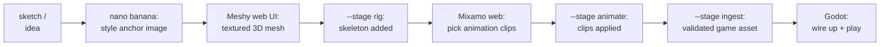

# Creating a Character for WoadRaiders — the complete beginner's guide

This guide walks you from *"I have an idea for a character"* to *"my character
is running around in the game with a sword"*, assuming you have never done 3D
modeling, rigging, animation, or game development before. Every term is
explained the first time it appears. The Warrior (working name Torga) was the
first character built this way, and this guide uses him as the worked example
throughout — when in doubt, look at `art-pipeline/characters/warrior/` and
copy what it does.

For the *why* behind the pipeline's design decisions, read
[character-pipeline.md](character-pipeline.md) afterwards. This document is
the *how*.

---

## 1. What a game character actually is

A playable 3D character is four separate things bundled into one file:

| Piece | What it is | Who makes it for us |
|---|---|---|
| **Mesh** | The 3D shape — thousands of connected triangles forming the body's surface | Meshy (an AI web tool) |
| **Textures** | Images wrapped around the mesh that give it color and detail | Meshy, from our concept art |
| **Rig (skeleton)** | An invisible tree of "bones" inside the mesh. Each vertex of the mesh is glued to nearby bones with weights, so when a bone moves the surface follows | Our local pipeline (`--stage rig`) |
| **Animation clips** | Recorded bone motion with names like `Idle`, `Run`, `Attack`. The game plays these on the skeleton | Mixamo (Adobe's free web library), applied by `--stage animate` |

All four travel together in a **GLB** file — the standard shipping container
for 3D assets (it's the binary form of "glTF"; you'll see both words). The
game engine, **Godot**, opens the GLB, shows the mesh, and plays the clips.

The pipeline's core idea: **a character is data, not a manual art project.**
Everything that defines your character lives in a folder under
`art-pipeline/characters/<name>/` — a spec file, the concept art, the raw
downloads, the animation clips. The pipeline scripts turn that folder into a
game-ready GLB deterministically, so anyone can rebuild the character from
the repository alone.

### The journey at a glance



Two of these steps happen in a web browser with you clicking (Meshy, Mixamo);
everything else is one command each.

---

## 2. What you need before starting

Accounts (all have free tiers):

- **Google AI Studio** (or the Gemini app) — for **nano banana**, the image
  model that turns rough concept art into a clean "style anchor". Free.
- **Meshy** ([meshy.ai](https://meshy.ai)) — image → 3D mesh. Generations
  cost credits. **House rule: only a human ever spends Meshy credits.** The
  pipeline never calls Meshy's API — you click the buttons, you download the
  results. This is deliberate (credit-burn protection) and documented in the
  design doc; don't automate it.
- **Mixamo** ([mixamo.com](https://mixamo.com), free Adobe account) — a
  library of hundreds of humanoid animations you preview visually and
  download for free.

Local tools (already set up on the main dev machine; see
[character-pipeline.md](character-pipeline.md) for install details):

- **uv** — runs the Python pipeline (`uv run art-pipeline ...` from the
  `art-pipeline/` folder). It manages Python and packages automatically.
- **ComfyUI** with the UniRig/MIA nodes — the local AI rigging service.
  Start it with the Desktop "ComfyUI" shortcut before running `--stage rig`.
- **Godot 4 (.NET)** — the game engine. Command name: `godot-mono`.
- **.NET SDK** — builds and tests the game code (`dotnet test`).

---

## 3. Step 0 — Make the character's folder

Pick a lowercase folder name (the class name works: `rogue`, `mage`...).
Create `art-pipeline/characters/<name>/` with this inside:

```toml
# art-pipeline/characters/<name>/spec.toml
[character]
name = "Rogue"            # capitalized game-facing name
mesh_prefix = "Rogue"     # every mesh node gets this prefix at ingest
height_m = 2.0            # how tall this character IS in the world, in metres.
                          # 2.0 is the hero standard; enemies vary; the boss is 3.0.
                          # You never scale anything by hand — this number is law.

[ingest]
source_dir = "meshy"      # the "inbox" folder where raw downloads land
max_tris = 120000         # triangle budget (see step 4 — quads count double)
max_texture = 4096        # largest allowed texture edge, pixels

[ingest.clips]
# Only needed if your clips arrive with non-standard names (e.g. straight
# from Meshy's animation library). Blank values = clips are already named
# to the contract. With the Mixamo flow below you can delete this section.
```

Also create the inbox folder `art-pipeline/characters/<name>/meshy/` (empty
for now). Everything the pipeline *generates* goes to a `build/` subfolder it
creates itself; `build/` is gitignored — only inputs and approved results are
committed.

**Why `height_m` matters:** the game world uses 32 units per metre
(`pipeline.toml [world]`). At ingest, the pipeline *bakes* your character's
height into the file's actual vertex data — the shipped GLB IS 64 units tall
for a 2 m character, no scale factors anywhere. This sounds like a detail; it
is actually the resolution of a week-long bug hunt. Never add scale wrappers
in Godot; declare the height here.

---

## 4. Step 1 — Concept art: the style anchor

The **style anchor** is one clean, front-facing, full-body image of your
character that Meshy will turn into 3D. Good input = good mesh; this step
decides most of the final quality.

1. Start from anything — a friend's pencil sketch, a photo of a miniature, a
   text description. Commit whatever you start from (the Warrior keeps
   `sketch.jpg`) — provenance matters when you regenerate later.
2. Ask **nano banana** to render it as a game character. The prompting
   recipe that produced the Warrior:
   - full body, **facing camera, in an A-pose** (arms slightly lowered, like
     a relaxed T-pose — riggers prefer it, and Meshy respects it),
   - **empty hands** (weapons come later as separate props — a fused sword
     ruins the rig),
   - neutral background, even lighting, whole figure in frame,
   - the WoadRaiders look: painterly, cel-shaded, chainmail-and-cloth — read
     [art-style.md](art-style.md), the style bible, and reference the
     Warrior's committed anchor for consistency,
   - average human proportions (check the result isn't stretched or
     chibi-headed; ask it to fix proportions if so).
3. Iterate until you like it. Save the winner as
   `characters/<name>/style_anchor.png` and commit it, plus the intermediate
   nano banana outputs you found useful (`nano_banana_ref*.png` pattern).

There is no automation here on purpose: taste is the tool. Expect this to
take longer than every other step combined, and that's fine.

---

## 5. Step 2 — The 3D mesh, in Meshy's web UI

You do this in a browser, logged in as yourself. **The pipeline never spends
Meshy credits.**

1. On [meshy.ai](https://meshy.ai): **Image to 3D**, upload
   `style_anchor.png`, generate. Pick the best candidate.
2. **Remesh** it (Meshy's retopology feature) to roughly **49k quads** with
   **pose enforcement / A-pose** if offered. Two vocabulary notes:
   - A "quad" is a four-sided face; the GLB stores each quad as two
     triangles, so 49k quads ≈ 98k triangles. The spec's
     `max_tris = 120000` is a *triangle* budget — quads count double.
   - Texture at 4096 px ("4K") — the hero budget from the spec.
3. Download as **GLB** and drop the file into
   `art-pipeline/characters/<name>/meshy/` (the inbox). Any filename works;
   the pipeline takes the newest GLB there. Commit it — raw inputs are part
   of the character's source.

Don't worry about size or position — the ingest stage normalizes everything.
Do worry about the silhouette, face, and texture quality: what you see in
Meshy's preview is what you'll get in game.

---

## 6. Step 3 — Rigging (one command)

Rigging gives the mesh a skeleton. Ours is hands-free:

```bash
uv run art-pipeline <name> --stage rig
```

(Run from `art-pipeline/`. ComfyUI must be running — Desktop shortcut.)

This sends the newest inbox GLB through **MIA** (Make-It-Animatable), which
produces the standard **mixamorig** skeleton — 52 bones with names like
`mixamorig:Hips`, `mixamorig:RightHand`. Every WoadRaiders character gets
this same skeleton, which is what lets characters share animation clips.
Outputs land in `characters/<name>/build/`:

- `<name>_rigged.fbx` — you'll upload this to Mixamo next
- `<name>_rigged.glb` — same thing, for quick inspection

The stage also automatically grounds the feet at y=0 and centers the
character.

**Posture fixes.** Auto-rigs inherit the mesh's flaws: the Warrior's mesh
carried a slightly dropped chin, so every animation had him staring at the
floor. The fix is declarative — add degrees of upward pitch per bone in the
spec and re-run the stage:

```toml
[rig.rest_pose]
"mixamorig:Neck" = 6
"mixamorig:Head" = 12
```

How to find these numbers: upload the rigged FBX to Mixamo (next step), look
at it in a neutral animation, and eyeball what's wrong ("looking down a
little" ≈ 10–15° across neck+head). Adjust, re-run `--stage rig`, re-upload.
Each character will need different corrections; that's why they live in the
spec.

---

## 7. Step 4 — Animation clips, from Mixamo

The game's animation contract is four **standard clip names** the code looks
for: **`Idle`, `Run`, `Fall`, `Attack`** (reserved for later: `Walk`,
`Jump`, `Hit`, `Death`). Your job is to fill those four slots with motion
that fits your character.

1. Go to [mixamo.com](https://mixamo.com) and **upload
   `build/<name>_rigged.fbx`** (Upload Character). Mixamo retargets its
   whole library onto *your* character — you preview every clip on your own
   model. This visual browsing is the fun part; take your time.
2. Pick one clip per slot. Match the character's fantasy: a sword-and-shield
   idle for a shield-bearer, a skulking idle for a rogue. For **Run**, tick
   Mixamo's **"In Place"** checkbox — the game moves the character; the clip
   must not (ingest rejects clips with root motion).
3. Download each clip as **FBX Binary, Without Skin, 30 fps**.
4. **Rename each file to its contract name** — the filename IS the clip
   name: `Idle.fbx`, `Run.fbx`, `Fall.fbx`, `Attack.fbx`. Extras
   (`Death.fbx`, `Hit.fbx`) ride along under their own names.
5. Put them in the right folder:
   - `art-pipeline/clips/mixamo/` — the **shared library**, for genuinely
     universal motion (falling looks the same for everyone; `Fall.fbx`
     already lives here and your character inherits it for free).
   - `art-pipeline/characters/<name>/clips/` — **this character only**. A
     file here overrides a shared file with the same name. Armed stances are
     personal: the Warrior's `Idle/Run/Attack` live here.
   - To *reject* a shared clip without replacing it:
     `[animate] exclude = ["Name"]` in the spec.
6. Apply the library:

```bash
uv run art-pipeline <name> --stage animate
```

This layers shared + per-character clips onto the rigged character and
writes `build/<name>_animated.glb` — a complete character, minus weapons.

---

## 8. Step 5 (optional) — Weapons and shields

Props are **separate Meshy generations** (remember: the anchor had empty
hands). Generate each in Meshy from its own prompt/sketch, download the
GLBs into the same `meshy/` inbox, and declare them in the spec:

```toml
[ingest.props]
weapon = { file = "sword.glb", bone = "mixamorig:RightHand", name = "Rogue_Weapon", offset = [0, 0, 0], rotation_deg = [0, 0, 0], scale = 0.6 }
```

At ingest each prop is merged into the shipped GLB and rigidly attached to
its bone — it follows the hand through every animation.

**Getting the numbers right is a solved problem — do not eyeball it.** The
hard-won lessons, in one paragraph: a prop looks right only in the pose
players actually see (the *idle animation*), not in the T-pose the file is
built in, because wrists roll a lot between the two. And prop files have
arbitrary internal orientations (the Warrior's sword lies *diagonally* in
its own file). So we solve mathematically: measure the prop's anatomy (where
the grip is, which way the blade faces) by slicing the mesh along its axes,
read the hand bone's orientation *in the sampled idle pose*, and compute the
rotation/offset that puts the grip in the palm. The scripts that did this
for the Warrior are:

- `art-pipeline/tools/prop_fit_solve.py` — computes spec values (has
  by-eye adjustment knobs at the top: roll, tilt, forward pitch)
- `art-pipeline/tools/prop_fit_verify.py` — poses the *shipped* GLB in the
  idle frame, renders it to `build/idle_pose_check.png`, and asserts the
  orientations so nothing silently regresses

Both are written for the Warrior's sword and shield; for a new character,
copy the pattern and update the measured constants at the top (the spec.toml
comments in the warrior folder document how each number was measured). Budget
an hour of iterate-render-look; it converges fast because it's math, not
guessing.

---

## 9. Step 6 — Ingest: making it a game asset

```bash
uv run art-pipeline <name> --stage ingest
```

(`--dry-run` first if you want an inventory without writing anything.)

This is the quality gate and the only stage that touches the game folder. In
order, it:

1. takes `build/<name>_animated.glb` (or the newest inbox GLB if you skipped
   rig/animate because Meshy did those for you — in that case fill
   `[ingest.clips]` with Meshy's clip names so they can be renamed to the
   contract),
2. renames clips to the contract and prefixes every mesh node with
   `mesh_prefix` (the game's weapon-visibility system,
   `CharacterLoadout`, keys off these prefixes),
3. merges and attaches `[ingest.props]`,
4. **bakes world scale** — multiplies every vertex, bone, and animation
   track so the character stands exactly `height_m × 32` units, feet at
   ground zero, no scale nodes anywhere,
5. validates: triangle budget, texture sizes, all four contract clips
   present, `Run` has no root motion,
6. promotes the result to
   `WoadRaiders.Client/assets/characters/<Name>.glb` with a provenance
   sidecar recording exactly what produced it.

If validation fails it tells you why (with what it found instead); nothing
broken ever reaches the game folder.

---

## 10. Step 7 — Wiring it into the game code

The easiest first project is **replacing the visuals of an existing class**
(Rogue, Mage, Ranger still use KayKit chibi placeholders). That's a
two-file change. Creating a *brand-new* class (a new byte on the network
wire, new server-side stats) is a bigger job — see the enum/protocol notes
in the design doc before attempting it.

**File 1: `WoadRaiders.Client/scripts/world/WorldView.cs`** — how the class
appears in the world. Find `ClassVisuals` and replace the class's entry:

```csharp
[CharacterClass.Rogue] = new("res://assets/characters/Rogue.glb", "Attack", WorldScaleAsset),
```

`WorldScaleAsset` is `1f` — pipeline characters ship at world scale already
(that's the baking in step 6). The `"Attack"` string is which clip plays on
strikes. (KayKit holdovers instead use `CharScale` and KayKit clip names —
you're deleting one of those entries.)

**File 2: `WoadRaiders.Client/scripts/ui/title/ClassCard.cs`** — the class
selection screen. In `Flavor`, update the entry:

```csharp
[CharacterClass.Rogue] = ("res://assets/characters/Rogue.glb", "Knife-quick shadow", 64f),
```

The last number is the model's height in world units — `height_m × 32` (64
for a 2 m character). The card uses it to frame the turntable camera; get it
wrong and your character's knees fill the card.

Clip playback needs no wiring: `CharacterView` already prefers the standard
names (`Run`, `Fall`, ...) and falls back to KayKit names for unmigrated
models automatically.

**Enemies are different:** they're sized in *metres* in `WorldView`'s
`EnemyVisuals` via `KayKitScale(1.2f)`-style declarations, and a static
guard warns if any non-boss enemy stands taller than the 2 m player. If your
new character is an enemy, follow that pattern instead.

---

## 11. Step 8 — Import, test, play

Godot doesn't read GLBs directly at runtime — it *imports* them into its own
cache first, and a stale cache means you'll stare at the old character
wondering why nothing changed. The rules:

- **If the Godot editor is open:** click into its window; it rescans and
  reimports automatically. Then run the game.
- **If it's closed:** import headlessly:

```bash
cd WoadRaiders.Client; godot-mono --headless --import
```

- **Never** delete `.godot/imported/` while the editor is open (it corrupts
  the session — null-reference errors everywhere), and never run the
  headless import while the editor is open either. Check first.

Then verify:

```bash
dotnet test
```

(from the repo root — the suite includes guards like the enemy-height law),
and launch the game. Walk through the checklist: class card looks right and
is framed well → spawns at sensible size next to other characters → Idle
looks right → Run moves without foot-sliding → Attack swings → walk off a
ledge for Fall → weapons sit right *during* animations, not just standing
still.

Commit everything: the spec, anchor, inbox GLBs, clips, the promoted
`.glb`, extracted textures with their `.import` files, and the code edits.
The repo convention is a poetic one-line commit title; read `git log` and
you'll get the idea.

---

## 12. The traps (read this before your first character, again after)

Every one of these cost real debugging time on the Warrior:

- **Measure meshes, not bones.** A model's visual top can be far above its
  topmost bone (KayKit skulls float above the last bone). Any size logic
  based on "bone height" lies to you.
- **Scale must be baked, not wrapped.** Godot's skinned-mesh path leaks
  parent scale in surprising ways. The pipeline bakes scale into vertex data
  precisely so no one ever puts a `scale = 2.0` node anywhere. If a
  character is the wrong size, fix `height_m` and re-ingest.
- **Props fit in the idle pose, not the T-pose.** See step 5. The wrist
  rolls ~90° between rest and idle; a fit that looks perfect in the build
  file can point the sword flat-to-camera in game.
- **Never automate Meshy.** Credits are money and the account is personal.
  The pipeline reads downloaded files only.
- **PowerShell will murder your imports:** piping a long-running native
  command through `Select-Object -First N` *kills the process mid-write*
  (this once half-imported the whole project). Redirect to a log file and
  read that instead. Also: `Set-Content -Encoding utf8` writes a BOM that
  breaks TOML parsers — use `[IO.File]::WriteAllText` with a BOM-less
  UTF-8 encoding if scripting file writes.
- **In Python, never round-trip a rigged GLB through `trimesh`** — it
  silently drops the skeleton and animations. Use `pygltflib` for surgery on
  rigged files (all pipeline code already does).
- **Godot renames bones on import:** `mixamorig:Hips` becomes
  `mixamorig_Hips` (colons are sanitized). Game code that looks up bones
  accounts for this; remember it when debugging in the editor.
- **Mixamo's Run must be In Place** — ingest enforces it, but you'll save a
  round-trip by ticking the box the first time.

---

## 13. Quick reference

```bash
# from art-pipeline/ — the whole local pipeline
uv run art-pipeline <name> --stage rig       # inbox GLB -> rigged FBX/GLB
uv run art-pipeline <name> --stage animate   # + clip library -> animated GLB
uv run art-pipeline <name> --stage ingest    # -> validated, promoted game asset
uv run art-pipeline <name> --stage ingest --dry-run   # look, don't touch

# prop fitting (Warrior-tuned; copy for new characters)
uv run python tools/prop_fit_solve.py
uv run --with matplotlib python tools/prop_fit_verify.py

# game side (repo root)
dotnet test
cd WoadRaiders.Client; godot-mono --headless --import   # editor CLOSED only
```

| I want to change... | Edit... | Then run... |
|---|---|---|
| Character's height | `spec.toml` `height_m` | ingest |
| Posture (chin, slouch) | `spec.toml` `[rig.rest_pose]` | rig → animate → ingest |
| An animation | swap the `.fbx` in `clips/` | animate → ingest |
| Weapon position | `[ingest.props]` via `tools/prop_fit_solve.py` | ingest |
| Triangle/texture budget | `spec.toml` `[ingest]` | ingest |
| Which clip plays on attack | `WorldView.cs` `ClassVisuals` | dotnet build |
| Class-card framing | `ClassCard.cs` `Flavor` height | dotnet build |

Further reading: [character-pipeline.md](character-pipeline.md) (design and
rationale), [art-style.md](art-style.md) (the look),
`art-pipeline/clips/mixamo/README.md` (clip library rules),
`art-pipeline/characters/warrior/spec.toml` (a fully annotated real spec).
