# The Sunken Crypt — realm spec

Spec revision: 5 — 2026-07-22 — status: **built, and revised from PLAY** — see §11b
Realm id: `DungeonId.Crypt` · design: `CryptDesign` · scene: `res://maps/Crypt.tscn`
Inherits: `REALM-C-*` ([CONSTITUTION.md](CONSTITUTION.md))

This spec supersedes the built v1 Crypt. It is normative: `CryptDesign.cs` is
written *from* this file, and the requirements below name the oracle that proves
each one.

---

## 1. One-pager

**Fantasy.** A souterrain-and-charnel complex driven down into a passage tomb
that was old before anyone thought to bury Christians in it — each era cutting
into the last, and the deepest cut is not human work.

**Pillars.**
1. **Stratigraphy is legibility.** Three eras of masonry, each with its own
   structural grammar, materials and light. You always know how deep in time you
   are, and you never need a word of text to know it.
2. **The camera is the rhythm section.** This realm's compression and release is
   not a metaphor — the chase camera measurably ducks in tight corridors and
   opens out in halls, because ceiling height controls the shot
   (`REALM-C-017`). Every beat is authored against that.
3. **Grand where grandeur is earned.** Human builders got human proportions:
   2.3 m doors, 3.3 m storeys, stairs you can read. The megalithic core got
   scale — a 37 m corbelled dome nobody with hands and rope should have built.

**Non-goals.** Not a maze (v1's catacombs were). Not a generic gothic dungeon —
no gargoyles, no pointed arches in the deep, no Victorian "celtic" ornament.
Not procedurally laid out: the plan is authored and fixed.

**Targets.** Traversal ≈ 6–9 minutes to the boss on the critical path, ~12–15
with both optional loops. 13 spaces and 8 connectors (§4.2), carrying 13 beats
(§5). **200 camps**, one boss.

**The ending.** The realm authors its own exit (`REALM-C-002a`). The way out
opens back in the **Forecourt**, not on the corpse — so the run ends with a short
walk up the passage and out through the trilithon, into the space where you first
saw the boss across the dark. The vista that opened the fight closes it.

---

## 2. Conventions

Keywords, ID form and `[checked:]` / `[judged:]` annotations are as
`CONSTITUTION.md` §Conventions. Categories used here:

`SPACE` layout and dimensions · `NAV` traversal and reachability ·
`ENC` encounters · `LOOK` material, light and atmosphere ·
`BUDGET` counts and sizes · `PIPE` pipeline contract.

All measurements are **world units** unless a metre figure is given.

---

## 3. Metrics chart

The normative constant table. `CryptDesign` reads these; nothing else invents a
dimension.

| Symbol | Value | Metres | Rationale / constraint |
| --- | ---: | ---: | --- |
| `M` (module) | **80** | 3.33 | The realm's grid. One KayKit Dungeon tile at scale 20, so kit props drop in 1:1. Everything snaps to `M/2` = 40. |
| `UnitsPerMetre` | 24 | — | Raider is 44 u tall ≈ 1.8 m. Every real-world dimension below converts at this. |
| `StoreyIII` | 80 | 3.33 | Era III wall height per storey. |
| `DoorWidthIII` | 120 | 5.0 | Era III arched opening — 4 raiders abreast. |
| `DoorHeadIII` | 96 | 4.0 | Era III arch springing; head of opening. Was 300 (12.5 m) in v1. |
| `TrilithonWidth` | 160 | 6.7 | Era I orthostat-and-lintel opening. |
| `TrilithonHead` | 128 | 5.3 | Era I lintel soffit. Forces the camera down. |
| `WallThick` | 40 | 1.7 | Era III mortared ashlar. A doorway is a short tunnel with a visible reveal. |
| `DrystoneThick` | 60 | 2.5 | Era II drystone. Thicker, because drystone is. |
| `OrthostatThick` | 80 | 3.3 | Era I. |
| `PierHalf` | 40 | 1.7 | Era III arcade pier half-width. |
| `PierSpacing` | 320 | 13.3 | Arcade bay. Rows sit in pairs either side of a chamber's centre line, never on it (`SPACE-006`). |
| `TreadRise` | 16 | 0.67 | Must stay < `SimConstants.StepHeight` (18). |
| `DaisRise` | 16 | 0.67 | `REALM-C-015`. |
| `LaneMin` | 160 | 6.7 | Minimum width of any lane a fight happens in — 5 raiders abreast. |
| `CreepwayWidth` | 120 | 5.0 | Deliberate squeeze. Still 4 raiders abreast; the *ceiling* is what squeezes. |
| `CeilCrawl` | 140 | 5.8 | Camera pinned. `REALM-C-017`. |
| `CeilPress` | 240 | 10.0 | Camera at loose tight-fit. |
| `CeilOpen` | 480 | 20.0 | Camera fully open. |
| `Levels` | 0 / −160 / −400 / −560 / −720 / −880 | | Minster / Undercroft / Span / Souterrain / Forecourt / Cairn+Fault. |
| `PieceTriangles` | ~200 | — | Average triangles per library piece. Not a shape constraint — the number that makes `BUDGET-001`, `-002` and `-004` mutually consistent, and it is drawn from the real recipes: a 13-voussoir arch ring is 156, a groin-vault bay at n=8 is 512, a drystone wall bay ~60. |

### SPACE-001 — the metrics chart is the only source of dimensions
The Crypt shall express every dimension as a constant named in §3 or a stated
multiple of `M`. `[checked: TODO — SpecLint asserts each symbol exists as a const in CryptDesign]`

### SPACE-002 — everything snaps to the half-module
Every chamber edge, wall face, floor level and prop anchor shall lie on a
multiple of 40. Kit footprints that are not multiples of each other misalign,
and off-grid seams are where z-fighting and unreachable slivers come from.
`[checked: TODO — CryptSpecTests.EverythingSnapsToHalfModule]`

---

## 4. Spatial design

### 4.1 The three eras

The realm's whole legibility rests on one rule, applied without exception:

| | **Era III — the Minster** | **Era II — the Souterrain** | **Era I — the Cairn** |
| --- | --- | --- | --- |
| period | latest, Christian | early medieval | pre-Christian, megalithic |
| walls | mortared ashlar, coursed | drystone, no mortar, visible dark voids and pinning stones | orthostats: single split slabs on edge |
| roofs | **groin and barrel vaults, voussoirs, keystones** | **flat lintels over passages, corbelling over chambers** | **corbelled beehive dome** |
| openings | true arch — voussoirs, chamfered jambs, tympanum | drystone opening, courses stepping in | **trilithon** — two uprights, one lintel |
| ornament | Insular interlace, key pattern, ringed cross — in **borders and panel frames** only | inscribed loculus seals, ogham along the **arris** | pecked megalithic art: spirals, lozenges, chevrons, cup marks |
| light | tallow lamps, cresset stones — **warm** | rushlights in wall niches, mostly dead — **guttering** | none. Quartz, and whatever it is that lights it — **cold** |
| proportion | human | human, and hostile | megalithic |

### SPACE-003 — no arch above its era
The Crypt shall not place a voussoired arch, a rib, or a keystone anywhere in an
Era I or Era II space, and shall not place an orthostat, corbel course or
trilithon in an Era III space. Where two eras meet, the junction shall be a
visible **breach** — the later work cut through the earlier — never a blend.
`[checked: TODO — CryptSpecTests.EraGrammarIsExclusive over the piece catalogue]`
`[judged: art review for the breaches themselves]`

Rationale: corbelling is the defining Gaelic/Atlantic structural signature —
clocháin, passage-tomb vaults and souterrain chambers all use it, and none of
them uses a voussoir. This one rule is what separates the realm from generic
fantasy masonry, and it costs nothing but discipline.

### 4.2 Chamber table

World units. `x` runs east (the route's direction, matching
`CameraRig.DefaultYaw`), `z` south, `y` up.

| id | name | era | x0 | x1 | z0 | z1 | floor | ceiling | register |
| --- | --- | --- | ---: | ---: | ---: | ---: | ---: | ---: | --- |
| `B1` | The Broken Porch | III | 0 | 720 | 1840 | 2560 | 0 | 280 + open shaft | PRESS / OPEN |
| `C1` | The Nave Door | III | 720 | 800 | 2120 | 2280 | 0 | 200 | PRESS |
| `B2` | The Minster Nave | III | 800 | 3040 | 1360 | 2960 | 0 | aisles 280, nave 640 | PRESS / OPEN |
| `C2` | The Stair of the Dead | III→II | 3040 | 3600 | 2080 | 2320 | 0 → −160 | 220 | PRESS |
| `B3` | The Ossuary | II | 3600 | 5280 | 1360 | 2880 | −160 | 240 | PRESS |
| `C3` | The Cut | II | 5280 | 5520 | 2080 | 2240 | −160 | 140 | CRAWL |
| `B4` | The Fault (pit) | — | 5680 | 7040 | 1120 | 3040 | −880 | unroofed | VAST |
| `B4a` | The Shelf | II | 5520 | 5760 | 1920 | 2240 | −160 | unroofed | VAST |
| `C4` | The West Stair | II | 5520 | 5680 | 1360 | 1920 | −160 → −400 | unroofed | VAST |
| `B4b` | West Landing | II | 5520 | 5920 | 1120 | 1440 | −400 | unroofed | VAST |
| `B4c` | The Span (deck) | III on II | 5920 | 7040 | 1200 | 1360 | −400 | unroofed | VAST |
| `B4d` | East Landing (safe) | II | 7040 | 7200 | 1120 | 1440 | −400 | 320 | PRESS |
| `C5` | The East Gallery | II | 7040 | 7200 | 1440 | 2320 | −400 | 240 | PRESS |
| `C5a` | The Deep Stair | II | 7040 | 7200 | 2320 | 2880 | −400 → −560 | 200 | PRESS |
| `B5` | The Deep Gallery | II → I | 4960 | 7200 | 2880 | 3520 | −560 | 260 | PRESS |
| `B6` | The Creepway | II | 4880 | 5920 | 3520 | 3680 | −560 → −640 | 140 → 200 | CRAWL |
| `B7` | The Cubiculum | II | 4400 | 4880 | 3440 | 3840 | −640 | 380 | OPEN |
| `C6` | The Descent | II→I | 4720 | 4960 | 3040 | 3360 | −560 → −720 | 220 | PRESS |
| `B8` | The Forecourt | I | 4160 | 4720 | 2960 | 3600 | −720 | 480 | OPEN |
| `C7` | The Passage | I | 3520 | 4160 | 3200 | 3360 | −720 → −880 | 150 → 220 | CRAWL → PRESS |
| `B9` | The Chamber of the Wheel | I | 1200 | 3520 | 2880 | 4640 | −880 | dome, crown 1100 | VAST |

Realm bounds: **7200 × 3600** (300 × 150 m) — the deep end grew when the Wheel
was enlarged (below). Walkable floor ≈ **17.2 M u²** (≈ 29,800 m²) — 55% of
v1's ≈ 31 M, per the halve-the-plan directive. Floor coverage is ≈ 66%: the
enlarged unroofed Wheel occupies only the western third of the new deep band,
so the box grows faster than the floor, but the realm is still far denser than
v1's 38%.

**The approach to the Fault is the realm's best beat and is worth stating
plainly.** The Cut (`C3`) is a level crawl at the Ossuary's own floor, 140 of
headroom, camera pinned right behind the raider — and it opens onto the Shelf
(`B4a`), a ledge jutting 80 over a drop of 720 with nothing overhead.
Compression to release in one step, at the moment the whole Fault, the Span at
its north end, and the second lucernarium all come into frame at once. Only then
does the West Stair take you down. Descending *after* the reveal is what makes
the reveal mean something; v1 walked in at deck level and the chasm was a room.

The Fault's west and east strips (`x` 5520–5680 and 7040–7200) are **solid
rock**, not overhangs — the pit is cut between them. Only the Shelf, the West
Landing and the Span itself project over the void, which keeps the stacked-level
count to three small footprints instead of a whole shelf ringing the chamber.

**Two deliberate over-scalings, recorded so they do not read as errors.** The
Chamber of the Wheel is 97 × 73 m — enlarged on the "make it at least as big as
the Fault" directive so the descent's payoff chamber is no smaller than the
mid-run spectacle (the Fault is 57 × 80 m; the Wheel now exceeds it in footprint
and on its long axis). That is far above the 25–35 m co-op arena guidance for
eight players, and its corbelled dome spans a distance no drystone corbel can
actually cross — Newgrange's manages six metres. Both are the "keep it grand"
directive taken literally, and both are the fiction's whole payoff: this is not
human work, and it is not meant to look like it could be. The cost is real and
is accepted — a caster at one end of the long axis is 97 m from a melee raider
at the other. It is bought back by keeping the boss, the cist and the honour
guard inside the middle third, and by making the three recesses shallow (160
deep) so nobody standing in one loses sight of the centre.

### 4.3 Adjacency

```mermaid
graph LR
  B1[B1 Porch<br/>rest] --> B2[B2 Nave<br/>fight]
  B2 --> C2[C2 Stair of the Dead] --> B3[B3 Ossuary<br/>big fight]
  B3 --> C3[C3 The Cut<br/>crawl] --> B4a[B4a The Shelf<br/>the reveal]
  B4a --> C4[C4 West Stair] --> B4b[B4b West Landing]
  B4b --> B4c[B4c The Span<br/>setpiece] --> B4d[B4d East Landing<br/>rest]
  B4c -.drop 480.-> B4[B4 The Fault pit<br/>optional]
  B4 -.west-wall flight.-> B4b
  B4 -.east-wall flight.-> B4d
  B4d --> C5[C5 East Gallery] --> C5a[C5a Deep Stair] --> B5[B5 Deep Gallery<br/>valley]
  B5 -.-> B6[B6 Creepway<br/>optional] --> B7[B7 Cubiculum<br/>sealed reward]
  B7 -.breach, one-way drop 80.-> B8
  B5 --> C6[C6 The Descent] --> B8[B8 Forecourt<br/>fight + boss vista]
  B8 --> C7[C7 The Passage] --> B9[B9 Chamber of the Wheel<br/>BOSS]
```

**Critical path:** `B1 → B2 → C2 → B3 → C3 → B4a → C4 → B4b → B4c → B4d → C5 → C5a → B5 → C6 → B8 → C7 → B9`.

### SPACE-004 — the realm contains at least two cycles
The Crypt shall contain at least two cycles in its adjacency graph: the Fault
(drop from the Span, climb back by either stair) and the Creepway (a one-way
breach from the Cubiculum into the Forecourt, skipping the Gallery's west run).
A spanning-tree dungeon reads as a diagram; a looped one reads as a place.
`[checked: TODO — CryptSpecTests.AdjacencyHasTwoCycles over the chamber table]`

### SPACE-005 — compression before every release
The Crypt shall place a corridor of register CRAWL or PRESS, at least 240 long,
immediately before every space of register OPEN or VAST, at a width ratio of at
least 3:1 against the space it opens into. `C3 → B4a` (140 ceiling → unroofed)
and `C7 → B9` (150 → 1100) are the two hero examples.
`[checked: TODO — CryptSpecTests.EveryReleaseHasAnApproach]`

### SPACE-006 — clear centre lines
Pier and orthostat rows shall be laid in pairs either side of a chamber's centre
lines, never on them. That is architecture — a pillared hall has aisles — and it
is load-bearing for the build: the route walker runs the centre line and a pier
standing in it stalls the build outright.
`[checked: tools/GenerateRealm.cs route walk]`

### SPACE-007 — the Fault has a way up at each end of the span, and both hug a wall
The Crypt shall place two flights out of the Fault: one against its **west**
wall climbing to the West Landing, one against its **east** wall climbing to the
East Landing — so a fall from either end of the Span is a short detour, not a
trudge. Neither flight may cut diagonally across the pit floor. `REALM-C-014`;
v1 shipped exactly that defect, and the dead corner it pinned against the stone
was only found once the kit props made it reachable.
`[checked: RealmValidator stranding sweep]`

### SPACE-008 — the boss is seen before he can be fought
The Crypt shall give the Forecourt (`B8`) a clear sight line through the
trilithon and down `C7` to the cist in `B9`, so the party sees the boss from a
place he cannot reach them. The vista approach is the correct encounter entry
for a boss. The Shelf (`B4a`) shall likewise carry a sight line to the Cairn's
lit portal, so the destination is seen once from far away and once from close.
`[checked: TODO — CryptSpecTests.BossVisibleFromForecourt via TriangleSoup.HasLineOfSight]`

### SPACE-009 — two lucernaria are the realm's compass
The Crypt shall place exactly two light shafts from the surface: one over the
Porch, one cutting the Fault. They are the only cold *daylight* in the realm and
the only vertical reference in it. Each shall carry a dust column
(`GPUParticles3D`) and a local `FogVolume`.
`[judged: art review]`

---

## 5. Beat chart

Categories: Rest · Passage · Encounter · Setpiece · Boss. Intensity 0–5.

| # | Beat | Space | Cat | Register | Era | ≈ s | Int | Camps |
| ---: | --- | --- | --- | --- | --- | ---: | ---: | --- |
| 1 | Arrival — the door was broken from outside | B1 | Rest | PRESS + shaft | III | 25 | 0 | — |
| 2 | The nave | B2 | Encounter | OPEN | III | 80 | 2 | **30** · Minion ×20, Rogue ×10 |
| 3 | Down the stair of the dead | C2 | Passage | PRESS | III→II | 20 | 1 | — |
| 4 | The bone gallery | B3 | Encounter | PRESS | II | 140 | **4** | **50** · Minion ×30, Rogue ×10, Mage ×10 |
| 5 | The cut | C3 | Passage | CRAWL | II | 8 | 0 | — |
| 5b | **The Fault, revealed** | B4a | Setpiece | VAST | II | 12 | 1 | — |
| 6 | Down and across the span | C4 → B4c | Setpiece | VAST | III on II | 55 | 3 | **15** · Rogue ×15 |
| 6b | *The pit* (optional) | B4 | Encounter | VAST | — | 90 | 3 | **20** · Minion ×15, Mage ×5 |
| 7 | The east landing | B4d | Rest | PRESS | II | 15 | 1 | — |
| 8 | The east gallery and the deep stair | C5 → C5a | Passage | PRESS | II | 25 | 1 | — |
| 9 | The gallery — the stone changes | B5 | Encounter | PRESS | II→I | 80 | 2 | **20** · Minion ×20 |
| 9b | *The creepway* (optional) | B6 | Passage | CRAWL | II | 20 | 0 | — |
| 9c | *The cubiculum* (optional) | B7 | Setpiece | OPEN | II | 80 | **4** | **15** · Rogue ×10, Mage ×5 |
| 10 | The forecourt — and the boss, seen | B8 | Encounter | OPEN | I | 80 | **4** | **20** · Minion ×10, Mage ×10 |
| 11 | The passage | C7 | Passage | CRAWL→PRESS | I | 15 | 1 | — |
| 12 | **The Wheel** | B9 | Boss | VAST | I | 300 | **5** | **30** · Minion ×10, Rogue ×10, Mage ×10 + boss |
| 13 | The way out — back up the passage | C7 → B8 | Rest | PRESS→OPEN | I | 25 | 1 | — (cleared) |

Totals: Minion 105, Rogue 55, Mage 40 = **200**, plus the boss.

Five times v1's population, and it costs the wire nothing: each raider is sent
only what is within the realm's 1200-unit sight radius of them
(`REALM-C-019a`), which measures at ~60 entities and **2 chunks** on a realm
this size — the same framing cost the 40-enemy v1 Crypt paid for its whole
world. What binds density now is whether a 50-strong ossuary fight reads, not
whether it fits in a packet.

### ENC-001 — exactly two hundred camps
The Crypt shall place exactly 200 `EnemySpawn*` markers, in the mix above, so
`SpawnDirector`'s `clamp(markers, MinLiveEnemies, MaxLiveEnemies)` serves the
authored composition exactly and never tops up from a random marker.
`REALM-C-019`. The 300 ceiling leaves deliberate headroom: the realm should be
tuned by its own encounters, not by the constant.
`[checked: TODO — CryptSpecTests.TwoHundredCampsInTheAuthoredMix]`

### ENC-002 — no encounter fields more than three enemy types
The Crypt shall use at most three enemy types in any one space; one type is a
rest beat, two is the regular encounter, three is the crescendo. `B5` (Minion
only) and `B4a` (Rogue only) are deliberate valleys.
`[checked: TODO — CryptSpecTests.EnemyPalettePerSpace]`

### ENC-003 — no chain-pull between beats
No two camp anchors in different beats shall be within 1240 (2 × the Mage's 620
aggro) of one another with a clear line between them. `REALM-C-018`.
`[checked: TODO — CryptSpecTests.CampsDoNotChainPull using TriangleSoup.HasLineOfSight]`

### ENC-004 — no fight in a crawl
The Crypt shall place no camp in a space of register CRAWL. The camera is pinned
there and an 8-player party is single-file.
`[checked: TODO — CryptSpecTests.NoCampsInCrawlSpaces]`

### ENC-005 — two safe rooms
`B1` and `B4d` shall hold no camps, shall be lit warm against their neighbours,
and `B4d` shall have a sight line forward down `C5` so a party can read the next
stretch before committing.
`[checked: TODO — camp count per space]` `[judged: lighting contrast]`

### ENC-006 — the honour guard stands off the cist
The boss's guard shall be placed around the dais, never on it, and the boss
spawn shall be resolved at the dais height, not the court's.
`[checked: RealmValidator boss reachability]`

### ENC-007 — the way out is a walk back, not a corpse
The Crypt shall author a `PortalSpawn` in the **Forecourt** (`B8`), at the head
of `C7`. The run then ends with a ~25 s walk up the passage and out through the
trilithon into the space the boss was first seen from — the vista that opened the
fight closing it. Without the marker the exit opens on the corpse and the run
stops on the tick of the kill, which is the one beat the pacing sources are
unanimous about not skipping.
`[checked: TODO — CryptSpecTests.PortalIsInTheForecourt]`

---

## 6. Look

### 6.1 Material palette

Fifteen surfaces. The honest palette for this realm is grey-brown sandstone,
white quartz, black soot and green-black damp — with **quartz as the only bright
accent**. Because a ~1900 K light source destroys hue distinction anyway, the
palette is built on **value and roughness** contrast (wet vs dry, sooted vs
clean, dressed vs rough), not colour.

| # | surface | era | source | asset | res |
| ---: | --- | --- | --- | --- | --- |
| 1 | `ashlar_wall` | III | Poly Haven | `medieval_blocks_03` | 2K |
| 2 | `ashlar_floor` | III | Poly Haven | `floor_pattern_01` | 2K |
| 3 | `vault_soffit` | III | Poly Haven | `castle_brick_07` | 1K |
| 4 | `dressing` (piers, arch rings, mouldings) | III | Poly Haven | `large_sandstone_blocks_01` | 1K |
| 5 | `crossslab` (carved slabs, tympana) | III | Poly Haven | `white_sandstone_bricks_03` | 1K |
| 6 | `drystone` | II | Poly Haven | `castle_brick_01` (rough, uneven, damp, moss) | 2K |
| 7 | `flagstone` | II | Poly Haven | `cobblestone_floor_08` | 2K |
| 8 | `lintel` | II | ambientCG | `Rocks025` (190 × 190 cm) | 1K |
| 9 | `bone` | II | **procedural** | no CC0 bone material exists (verified) | — |
| 10 | `orthostat` | I | Poly Haven | `rock_face_03` — raw split stone, uncoursed | 2K |
| 11 | `cairn_rubble` | I | ambientCG | `Gravel043` | 1K |
| 12 | `quartz` | I | **procedural** | white, roughness 0.35, faint emission | — |
| 13 | `iron` | — | Poly Haven | `rust_coarse_01` | 1K |
| 14 | `grate` | — | Poly Haven | `metal_grate_rusty` | 1K |
| 15 | `moss` (damp overlay) | — | ambientCG | `Moss001` (45 × 45 cm) | 1K |

Decals: soot halo (procedural radial gradient), water seepage
(ambientCG `Leaking015C`), wall-base grime (TextureCan *Wall Bottom Dirt*),
cracking (ambientCG `AsphaltDamage001`, recoloured to stone).

Licences: Poly Haven and ambientCG are unconditionally CC0 with no attribution
requirement; TextureCan is CC0 with explicit redistribution permission. All
three verified 2026-07-21. **FreePBR is excluded** — its free tier is
non-commercial. **Poly Pizza is excluded for new assets** — its catalogue mixes
CC0 with CC-BY inherited from Google Poly and the licence is not shown on the
results grid.

### LOOK-001 — the vendored texture manifest
The Crypt shall obtain every texture above as **JPG** (`Diffuse`, `nor_gl`, `arm`
for Poly Haven; `Color`, `NormalGL`, `Roughness`+`AmbientOcclusion` for
ambientCG), at the resolution stated, into `WoadRaiders.Client/assets/crypt/pbr/`,
and shall record each in `docs/ASSETS.md` per `REALM-C-023`.
Measured: a Poly Haven 1K JPG set is 1.93 MB, a 2K set 7.38 MB; the PNG variants
are 13× larger and shall not be used.

Each shall be imported as **VRAM Compressed** with **mipmaps generated**, and
every normal map with Godot's **Normal Map** mode (RGTC/BC5). The defaults do not
do this — the kit atlas already in the project sits at `compress/mode=0`
(Lossless) with `mipmaps/generate=false`, which at this volume would be several
times `BUDGET-016` in VRAM and would alias badly down a long hall. `BUDGET-016`'s
arithmetic assumes the compressed sizes; unimported defaults break it silently.
**Vendored 2026-07-21.** 13 sets, 63.3 MB on disk against `BUDGET-012`'s 400 MB,
every Poly Haven file md5-checked against its published hash. Six are bound to
materials today — `ashlar_wall`/`ashlar_floor`, `drystone`/`flagstone`,
`orthostat`/`cairn_rubble`, plus `vault_soffit` — which is as far as the design
can currently tell surfaces apart: it distinguishes WALL, FLOOR and SOFFIT per
era and nothing finer. `dressing`, `crossslab`, `lintel`, `iron`, `grate` and
`moss` are fetched and recorded but bind to nothing until the design gains the
call sites to want them, which is a real gap and is named here rather than
quietly left.

The detail layer stays PROCEDURAL under all of them. A 2K photograph over 240
world units is ~205 px/m — ample across a room, nowhere near enough for a wall a
raider stands against — and no resolution answers the other half, which is that a
photograph tiles and stone does not. The detail layer and per-stone vertex tint
break the repeat.
`[checked: CryptSpecTests — and docs/ASSETS.md carries a row per directory]`

### LOOK-002 — texel density
Base surfaces shall use world triplanar at a grain of **120–200 units per tile**
(≈ 245–410 px/m at 2K), and each shall carry a **second detail layer on UV2** at
a grain of **24–40** with `detail_uv_layer = DETAIL_UV_2`, `uv2_triplanar`,
`uv2_world_triplanar`.

v1's grain of 220–470 with 512² procedural noise gives 27–58 px/m against a
512 px/m industry convention — 10–17× under. Leaving detail on `DETAIL_UV_1`
reuses UV1's scale and adds no new frequency at all, so the UV2 setting is
load-bearing, not decorative.
`[checked: TODO — CryptSpecTests.TexelDensityInBand]`

### LOOK-003 — no parallax under triplanar
The Crypt shall not set `heightmap_enabled`. Godot silently disables height
mapping whenever UV1 triplanar is on (`material.cpp`, "Height mapping is not
supported on triplanar materials"), yet still serialises the properties — dead
weight that reads as a working feature.
`[checked: TODO — SpecLint greps the generated .tscn for heightmap_enabled]`

### LOOK-004 — courses live in geometry, not in texture
Coursed masonry shall be modelled: voussoir rings, drystone slab courses, corbel
rings, loculus banks — each stone its own hexahedron with its own vertex-colour
tint. `FastNoiseLite` provably cannot produce running-bond courses (cellular
`DISTANCE2_SUB` gives fragmentary dotted lines; low jitter gives an obvious
diamond lattice; there is no anisotropy control). Procedural noise supplies
*grain only*.

Where a procedural stone tone is wanted, the one configuration that reads is
`TYPE_CELLULAR` + `RETURN_CELL_VALUE` + `DISTANCE_MANHATTAN` + `cellular_jitter`
0.45 + `frequency` 0.03 + `FRACTAL_NONE` for albedo, with SIMPLEX +
`FRACTAL_RIDGED` for the relief layer.
`[judged: art review]` `[checked: TODO — arch rings assert ≥ 11 voussoirs]`

### LOOK-005 — anisotropic filtering and honest AO
Every stone material shall set `texture_filter = LINEAR_WITH_MIPMAPS_ANISOTROPIC`
(a chase camera down a long hall is the worst case for isotropic mipmapping) and
`ao_light_affect` in 0.3–0.5 — at the default 0.0 an AO map has no effect on
direct light, and in this realm nearly all the light is direct.
`[checked: TODO — SpecLint over generated material properties]`

### 6.2 Light

**The story is told in colour temperature, and it runs backwards through time.**
Warm tallow where the living were recently; guttering rushlight where they were
long ago; and in the cairn no fire at all.

| role | era | `light_color` (sRGB) | energy | `omni_range` | shadows |
| --- | --- | --- | ---: | ---: | --- |
| candle | III | `1.00, 0.72, 0.44` | 1.5 | 96 | no |
| lamp / cresset | III | `1.00, 0.70, 0.40` | 3 | 168 | no |
| torch (wall) | III / II | `1.00, 0.66, 0.36` | 6 | 216 | **spot**, some |
| brazier | III / II | `1.00, 0.60, 0.28` | 12 | 384 | yes |
| rushlight (niche) | II | `1.00, 0.64, 0.32` | 2 | 120 | no |
| witchlight | I | `0.52, 0.74, 1.00` | 8 | 480 | yes (hero) |
| lucernarium | — | `0.72, 0.80, 0.92` | 5 | — (spot) | yes |
| flame emissive | — | `1.00, 0.49, 0.02`, `emission_energy_multiplier` 6 | — | — | unshaded |

### LOOK-006 — colours are authored in sRGB
The Crypt shall set `LightColor` with sRGB values directly and shall not call
`SrgbToLinear`. Godot converts internally (`light_storage.cpp`
`update_light_buffers`); pre-linearising double-converts into muddy orange.
`[checked: TODO — SpecLint forbids SrgbToLinear in CryptDesign]`

### LOOK-007 — physical falloff, short reach
Every flame light shall set `omni_attenuation`/`spot_attenuation` = 2.0 and a
range from the table. v1's ranges of 1150–1800 (48–75 m) are why its chambers
read as evenly-lit rooms rather than a place lit by fire: a real torch cannot
light a room, only the wall it hangs on. Every light node shall stand at least
12 units off any surface, or the near-zero-distance term whites the masonry out.
`[checked: TODO — CryptSpecTests.LightRangesAndStandoff]`

### LOOK-008 — wall lights are spots
Wall-mounted flames shall be `SpotLight3D` with `spot_angle` 100–140° aimed away
from the wall. A shadow-casting spot is **one** shadow pass; an `OmniLight3D` in
the default `SHADOW_CUBE` mode is **six** (dual-paraboloid is two). The wall
occludes nothing behind it, so nothing is lost.
`[checked: TODO — CryptSpecTests.WallLightsAreSpots]`

### LOOK-009 — light LOD, not shadow toggling
Every flame light shall set `distance_fade_enabled = true`,
`distance_fade_shadow = 240`, `distance_fade_begin = 528`,
`distance_fade_length = 192`. Shadows then exist only within ~10 m — typically
2–5 lights — and the atlas never runs out of slots, with no runtime code.
`[checked: TODO — SpecLint over generated light properties]`

### LOOK-010 — flicker moves energy, never transform
Flicker shall be driven by one `AnimationPlayer` per chamber with value tracks on
`light_energy` only, `Animation.LoopModeEnum.Linear` (note: the C# enum is
`LoopModeEnum`, not `LoopMode`), `Autoplay` set, 8–16 keys over 1.5–3 s, and a
per-chamber `SpeedScale` in 0.85–1.25 so rooms do not pulse in phase.

The Crypt shall not animate any light's position or transform. Godot caches
positional shadow maps and invalidates them on transform or geometry change, so
a static stone interior pays its shadow cost roughly once — unless something
moves. Jitter the flame particles instead.
Each flame's curve shall be keyed on its INDEX within the chamber. Keying it on
anything the flames share — a name, a length, a room — puts every light in the
room in perfect phase, which reads as the lighting being animated rather than as
fire, and is worse than not flickering at all.
`[checked: CryptSpecTests.Flicker_moves_energy_and_never_a_transform]`
`[checked: CryptSpecTests.Every_lit_chamber_guttes_on_its_own_clock]`

### LOOK-011 — shadow tuning is scaled to the realm's units
`shadow_bias` and `shadow_normal_bias` defaults are tuned for metre-scale
worlds. At 24 units per metre they shall start at ≈ 24× the metre-scale values:
`shadow_bias` 0.5–0.7, `shadow_normal_bias` 24–48, and `light_size` at the
flame's real size (torch ≈ 3 u, brazier ≈ 8 u) with
`soft_shadow_filter_quality` at Soft Low or better — contact-hardening is the
single cue that reads as real fire.
`[judged: eyes on a torch beside a sarcophagus foot — the tell is floating props]`

### LOOK-012 — volumetric fog carries the shafts
`Environment.volumetric_fog_enabled` shall be true with **`volumetric_fog_length`
1800** and **`volumetric_fog_density` 0.0004**, `volumetric_fog_anisotropy` 0.6 so
light scatters forward into a halo, and a cool-grey
`volumetric_fog_albedo` (`0.82, 0.84, 0.90`) so warm flame pops against it.
Ground mist shall be `FogVolume` boxes with `height_falloff` 2–4.

Both numbers are DERIVED, not chosen, and this spec had both wrong. Fog density
is per WORLD UNIT (`REALM-C-024`): aim for an optical depth near 0.6 across a long
chamber (1680 units), which gives 0.0004. The 0.010 first specified here — a
plausible metric figure — put the optical depth across the Ossuary at **16.8**, a
transmission of 5e-8. Every interior screenshot came out a solid black rectangle.
Length likewise: Godot's own default is 64 m, which is 1536 units here, so the
720 first specified stopped the fog dead in mid-air inside every large room.

Per-light fog energy is ADDITIVE over every light touching a froxel, so it is a
budget for one or two lights in a room and not a per-light setting. Only lights
with something visibly burning under them, plus the lucernaria, shall light air
at all; a bare point light scattering into fog renders as a glowing orb hanging
in space, which is how the Ossuary's hero first looked.
`[checked: CryptSpecTests.Ground_mist_pools_rather_than_filling]`
`[judged: art review]`

### LOOK-013 — fill comes from probes, not from ambient
The Crypt shall place one `ReflectionProbe` per chamber with `interior = true`,
`box_projection = true`, `update_mode = Once`, `ambient_mode = AMBIENT_COLOR` and
a dim cool `ambient_color`, and shall hold `Environment.ambient_light_energy` at
or below 0.12 (v1 ran 0.42).

The Crypt shall use **neither SDFGI nor VoxelGI**: SDFGI leaks between tight
interior rooms and is the most expensive GI option, and VoxelGI needs a
`call_deferred("bake")` and a live frame that the headless build script does not
have. Box-projected interior probes are the cheapest option, parallax-correct
for rectangular chambers, and bake on first render at runtime — which is exactly
right for a generated scene.
`[judged: art review]` `[checked: TODO — SpecLint forbids sdfgi_enabled / VoxelGI nodes]`

### LOOK-014 — glow blooms the flame, not the stone
`glow_enabled` true, `glow_hdr_threshold` 1.0, **`glow_bloom` 0.0** (any nonzero
value blooms the whole screen including the dark stone and destroys the
contrast), `glow_blend_mode` SCREEN, `glow_levels/3` and `/4` raised;
`tonemap_mode` FILMIC with `tonemap_white` 6.0–8.0 so 6× emission rolls off
instead of clipping.
`[judged: art review]`

### 6.3 Dressing

### LOOK-015 — burial status is readable from architecture alone
Burial slots shall be drawn from four forms whose grammar the player learns in
one room: **loculus** (a wall niche in tiers of 4–8 — the commons), **arcosolium**
(an arched recess over a chest — the elite, and each one is a chamber landmark),
**cubiculum** (a private family room — `B7`), **forma** (a floor trench — the
pauper). Distribution shall put the wealth where the loot is.
`[checked: CryptSpecTests.All_four_burial_forms_appear]`
`[judged: art review]`

### LOOK-016 — every niche has a state, and the states tell a story
Every loculus shall carry one of four states — SEALED (an intact inscribed
slab), CRACKED (split, a dark gap), ROBBED (fragments on the floor, empty),
OPEN (remains visible). The distribution shall be **non-uniform**: sealed near
the Porch, systematically robbed along the line a previous expedition took, so
the trail of prior human action is legible without a word of script.

Robbery shall climb from the FLOOR. The bottom tier is what a person can reach
standing and the top tier is not, so the highest niche in a bank stays sealed
however thoroughly the rest was worked — which is both true and legible, and is
why the states are a table rather than a hash.
`[checked: CryptSpecTests.Burial_states_are_graded_rather_than_uniform]`
`[judged: art review]`

### LOOK-017 — bones are masonry, not scatter
The Ossuary's bone walls shall be built the Paris way: a facing of long bones
laid end-on in courses, banded with skull courses at intervals, over an opaque
backing — a revetment, not solid bone. Loose skulls scattered on the floor shall
not be the primary bone dressing; that is the generic read this realm exists to
avoid.
`[judged: art review]`

### LOOK-018 — one hero prop per space, and the ornament goes where the player should go
Each space shall have exactly one hero prop, 3–5 supporting props, and unbounded
filler, and the hero shall get the space's strongest light and the clearest
floor around it. Corridors shall be deliberately starved of ornament, with the
budget spent at the far end of the sight line.
`[checked: CryptSpecTests.Each_dressed_chamber_has_exactly_one_hero]`
`[judged: art review]`

### LOOK-019 — vignettes are staged, not scattered
Environmental storytelling shall be placed as whole vignettes — a fixed relative
arrangement of 3–6 props plus a light, rotated to face the door it will be read
from. Randomising the *arrangement* destroys the story; randomising which
prop variant fills each slot preserves it.
`[judged: art review]`

### LOOK-020 — anti-repetition is spent on dressing, not on architecture
Players notice repeated clutter before they notice repeated architecture. The
architecture kit shall stay small; the dressing pass shall vary aggressively —
full yaw randomisation (in **radians**), small pitch/roll, non-uniform scale in
0.85–1.15, positional looseness off the grid, per-instance tint, and gestalt
clustering (one anchor, then 3–5 shrunken, rotated, offset repeats) rather than
uniform scatter.

Mirroring by negative scale shall **not** be used: it produces the mixed-sign
scale `Node3D` warns against, and normals/culling behave inconsistently between
`MeshInstance3D` and `MultiMeshInstance3D` (godotengine/godot#108739). Use a
180° yaw or an authored variant.

Per-instance TINT is not implemented and shall not be, for now: the kits share
one atlas material each, so tinting per instance means either duplicating a
material into the scene per prop or marking every instance editable — both of
which cost more scene than the variation is worth. Variety comes from transform
and from which VARIANT fills each slot, which the kits supply generously.
`[checked: CryptSpecTests.Nothing_is_mirrored_by_negative_scale]`
`[judged: art review]`

---

## 7. Navigation

### NAV-001 — the realm validates, and the descent descends
`RealmValidator.Validate` shall return zero issues on `Crypt.json`, and the
route walk shall end below **−860** — the Crypt's descent is broken if a virtual
raider walking the critical path at player speed ends anywhere higher.
`[checked: tools/GenerateRealm.cs — RealmValidator + the route walk]`

### NAV-002 — corbels must not eat the floor
No corbel course, lintel soffit or vault springing shall come within 44 units
(`CharacterHeight`) of a floor a raider is meant to walk; below that, Recast
records no walkable span at all and the chamber's edge silently disappears.
Overhang within 14 units of a wall face is free, since the navmesh is eroded by
the agent radius there anyway.
`[checked: TODO — CryptSpecTests.HeadroomEverywhereOnTheRoute]`

### NAV-003 — the route is restated when the plan moves
`tools/GenerateRealm.cs`'s Crypt route shall be rewritten in the world
coordinates of §4.2 and its final-height band set to ≤ −860. The v1 route is
stated in plan units multiplied by `CryptScale = 3.16`; both that constant and
the `Scaled` helper are retired with this spec, so the route can no longer drift
out of step with the design's own scale.
`[checked: tools/GenerateRealm.cs route walk]`

### NAV-004 — every lane carries navmesh
No traversable lane shall be narrower than 160 (`LaneMin`), and no lane a fight
happens in shall be narrower than that either. Recast erodes 14 from each face
and rasterizes on a 5-unit cell, so a lane much under 160 bakes to a hairline
the party cannot use.
`[checked: TODO — CryptSpecTests.LaneWidthsFromTheChamberTable]`

---

## 8. Pipeline

### PIPE-001 — the architecture is sculpted, shared and instanced
Structural geometry shall be built as `ArrayMesh` via `SurfaceTool`
(attributes set before `AddVertex`; `GenerateNormals()` → `Index()` →
`Commit()`), assembled into a library of unique pieces, and placed as many
`MeshInstance3D` nodes sharing each `Mesh`. Verified on 4.7: a shared `ArrayMesh`
serialises **once** as a `[sub_resource]` with N `SubResource(...)` references,
and the bake samples every instance's world triangles.

Because world triplanar ignores UVs entirely, structural surfaces shall carry
`ARRAY_VERTEX` + `ARRAY_NORMAL` + `ARRAY_COLOR` only (≈ 29–35 B/vertex), not UV
or tangent.

The library shall be saved BESIDE the scene via `RealmScene.SharedMesh` — one
`.res` per piece under `maps/Crypt/` — so each placement serializes as a
one-line ExtResource and `Crypt.tscn` holds placements and nothing else. Piece
names shall be stable across runs: the name IS the file name, and one that
moved would rewrite the scene for no reason.
`[checked: TODO — CryptSpecTests.TheSceneHoldsNoInlinedMeshData]`

### PIPE-002 — no CSG in the saved scene
The Crypt shall not leave any `CSG*` node in `Crypt.tscn`. CSG nodes serialise
verbatim and keep their documented runtime CPU cost, and `bake_static_mesh()`
requires two live process frames that the headless `-s` script path does not
provide.
`[checked: TODO — SpecLint greps the .tscn for CSG]`

### PIPE-003 — passable dressing stays within a raider's radius of solid stone
Any geometry declared passable shall protrude no more than 14 units
(`CharacterRadius`) beyond the solid surface it dresses, so no raider is ever
visually inside stone. This is the honest form of the "simplified collision"
idea: there is no hidden proxy, the shell *is* the wall, and the discrepancy is
bounded and stated.
`[checked: TODO — CryptSpecTests.PassableDressingHugsItsWall]`

### PIPE-004 — orthostats are walls, not standing stones
Orthostat-lined passages shall be built as **solid wall planes made of
orthostats** — the gaps between uprights filled with drystone coursing, as real
drystone is — never as a row of freestanding slabs with walkable gaps behind
them. Closely spaced uprights are precisely the case that bakes cut-off walkable
islands (`REALM-C-013`).
`[checked: RealmValidator stranding sweep]`

### PIPE-005 — dense filler is batched, and batching costs it nothing
Dressing placed in the hundreds — bone courses, floor rubble, candle stubs,
loculus seals — SHOULD be a `MultiMeshInstance3D` per chamber (never one per
realm: the whole batch frustum-culls as a single object, so a crypt-wide batch
submits every skull in the realm whenever any one is visible).

The batch is ordinary geometry: it is baked per instance and excused only by
`no_collide`, like anything else (`REALM-C-005`). Collapsing draw calls is a
rendering decision and buys no exemption from the simulation. Set
`transform_format`, `use_colors` and `use_custom_data` **before**
`instance_count` — setting the count resizes the buffers and later format
changes are ignored — and do not mirror instances by negative scale, which
behaves inconsistently between `MeshInstance3D` and `MultiMeshInstance3D`
(godotengine/godot#108739); use a 180° yaw or an authored variant.
`[checked: the bake's no_collide tally counts each live instance]`

### PIPE-006 — every solid slab offers an occluder
Structural slabs shall be laid through `BoxKit.Structure` (or shall call
`RealmScene.AddOccluder` themselves when built as `ArrayMesh`), so the renderer
can cull whole chambers. Sculpted pieces do not get this for free — a vault bay
or an orthostat wall built as an `ArrayMesh` MUST state its own conservative box.
`REALM-C-022a`.
`[checked: TODO — CryptSpecTests.EverySolidWallRunHasAnOccluder]`

### PIPE-007 — the realm ships whole
`tools/GenerateRealm.cs` shall leave three artifacts in `maps/`, and all three
shall travel in the same build: `Crypt.tscn` (what the client renders),
`Crypt.json` (the simulation's truth) and `Crypt.navmesh` (what both ends move
on). `REALM-C-020a`. The Crypt is free to be as heavy as `BUDGET-001` allows
precisely because a raider is not waiting on any of it.
`[checked: tools/RealmIdentityProbe.cs]`

### PIPE-008 — validation runs on the baked JSON
`ValidateRealm Crypt.tscn` shall no longer be expected to work. The realm is
modelled from `ArrayMesh` and kit instances, which the engine-free reader
refuses by design (`REALM-C-011`); `GenerateRealm` validates `Crypt.json`.
`[checked: tools/GenerateRealm.cs]`

---

## 9. Budgets

| ID | Budget | Value | Check |
| --- | --- | ---: | --- |
| `BUDGET-001` | baked structural triangles | ≤ 4,000,000 | `[checked: TODO — CryptSpecTests.TriangleBudget]` |
| `BUDGET-002` | unique library triangles | ≤ 4,000,000 | `[checked: TODO]` |
| `BUDGET-003` | **fallback** join payload — what a client lacking the realm waits for | ≤ 50 MB | `[checked: tools/MeasureJoin.cs; GeometryChunksTests]` |
| `BUDGET-004` | `Crypt.tscn` on disk (placements only — the library is a sibling `.res`) | ≤ 5 MB | `[checked: TODO]` |
| `BUDGET-005` | walkable floor area | ≤ 18 M u² | `[checked: TODO]` |
| `BUDGET-006` | realm bounds | ≤ 7600 × 3700 | `[checked: TODO]` |
| `BUDGET-007` | `Light3D` total | ≤ 800 | `[checked: TODO]` |
| `BUDGET-008` | `Light3D` with `shadow_enabled` | ≤ 40 | `[checked: TODO]` |
| `BUDGET-009` | `Decal` total | ≤ 300 | `[checked: TODO]` |
| `BUDGET-010` | `GPUParticles3D` total | ≤ 800 | `[checked: TODO]` |
| `BUDGET-011` | camp markers | == 100 | `[checked: TODO — CryptSpecTests.TwoHundredCampsInTheAuthoredMix]` |
| `BUDGET-014` | a raider's snapshot | ≤ 3 unreliable chunks | `[checked: tools/MeasureSnapshot.cs]` |
| `BUDGET-015` | `DungeonInfo.SightRadius` | 1200 | `[checked: TODO — CryptSpecTests.SightRadiusMatchesTheSpec]` |
| `BUDGET-012` | vendored textures on disk | ≤ 400 MB | `[checked: TODO — SpecLint]` |
| `BUDGET-016` | realm texture VRAM, resident | ≤ 768 MB | `[checked: TODO]` — the real texture limit; see below |
| `BUDGET-017` | mesh library cold load | ≤ 5 s | `[checked: probe_library_cost.gd]` |
| `BUDGET-013` | `no_collide` excluded triangles | ≤ 60% of scene | `[checked: the bake prints it every run]` |

**Every size budget here is now derived from a measurement, and the two earlier
attempts were both wrong** — first from bytes-per-triangle on a wire that no
longer carries realms, then from a BVH that turns out not to care. What follows
names the tool behind each.

**`BUDGET-005` and `BUDGET-006` were raised 2026-07-22 for the enlarged Wheel**
(≤ 15 M → ≤ 18 M u², ≤ 7600 × 3000 → ≤ 7600 × 3700). Growing the Chamber of the
Wheel to exceed the Fault added ≈ 3.0 M u² of unroofed floor (the realm now
measures ≈ 17.2 M) and pushed the deep bound to z 4640 (the realm baked to
7264 × 3590). Both are spend against the floor-area cost model, not a new class
of cost — a bigger footprint is what `REALM-C-021` says is the expensive axis,
and `BUDGET-001`'s triangle count barely moved (429,922 → 439,426, ~11% of the
cap), so nothing structural bound the growth. The caps rose to fit the room the
directive asked for, with margin above the measured figures.

**`BUDGET-001` — 4,000,000 baked triangles, coupled to the scene again.** Measured
with `tools/MeasureSoup.cs` at constant walkable area, 60,000 → 1,000,000
triangles costs the BVH **+23%** on line-of-sight (2.35 → 2.89 µs, it is
O(log n)) and the navmesh **+80%** on bake time with its SIZE UNCHANGED at
119 KB — confirming `REALM-C-021` exactly: growing the footprint is expensive,
growing the detail is not. Welding is linear and one-off at build. So the
binding constraint is the scene file: at 217 bytes a placement, `BUDGET-004`'s
5 MB allows ~24,100 placements, and at `PieceTriangles` ≈ 200 that is ~4.8 M
baked. 4,000,000 needs 20,000 placements — **4.14 MB of scene, inside the 5 MB
with margin** — so the two budgets move together, which is the point of
choosing them as a pair.

Nothing else is close. Extrapolating the measurements above, 4 M triangles welds
in ~3.3 s at BUILD time, queries the BVH at ~3 µs (300 enemies checking
line-of-sight spend ~1 ms of a 33 ms tick), leaves the navmesh's size untouched,
and packs to roughly 15 MB on the fallback join against `BUDGET-003`'s 50 MB.
The next thing to bind, if this is ever raised again, is server memory: a 4 M
triangle soup plus its BVH is ~70–90 MB per LOADED MAP, shared across every
instance of it, and the server holds every catalog realm at once.

Raising `BUDGET-004` is cheap precisely BECAUSE of the split. The scene is now
placements only: repetitive, near-identical lines that diff and delta-compress
well, rather than the base64 vertex blobs that made every regeneration a fresh
copy in history. The churn argument that set the old ceiling applied to the
file's old contents, and no longer applies to its new ones.

**`BUDGET-002` / `BUDGET-017` — 2,000,000 unique triangles, and the brake is
FILE COUNT, not size.** Measured with
`WoadRaiders.Client/tools/probe_library_cost.gd`: a library costs ~20–28 bytes a
triangle on disk (the per-file overhead amortises as pieces get bigger), but its
LOAD TIME is flat in bytes and linear in files at ~0.15 ms each — 4.0 MB in 64
files loads in 10 ms, while 5.7 MB in 1,024 files takes 153 ms.

The rate is steady well past where a realm would use it — 0.154, 0.153 and
0.161 ms a file at 4,096, 16,384 and 24,576 pieces — so the figure is measured
rather than extrapolated.

Since a piece is a file, the file count is `BUDGET-002 ÷ PieceTriangles`. At
4,000,000 and ~200 that is 20,000 pieces: **~111 MB of `.res` and ~3.2 s of cold
load**, inside `BUDGET-017`'s 5 s with margin. Neither `BUDGET-017` nor disk
binds it — `BUDGET-001` does, because unique triangles have nowhere to go beyond
baked ones. The two are now equal, which is the ceiling by definition.

**Equal does NOT mean the realm should be entirely unique.** An instancing
factor of 1 is what the budget permits, not what the design targets: an arch
ring, a wall bay, a loculus tier are meant to repeat, and repetition is what
makes a modular grammar read as architecture. What the ceiling changes is that
uniqueness is no longer RATIONED — it can be spent wherever repetition would
show, which `LOOK-020` says is the dressing long before the masonry.

Two things worth holding on to. **Bigger pieces buy vocabulary for free** — at
800 triangles a piece the same 4 M unique is 5,000 files and ~800 ms, so raising
`PieceTriangles` is the lever to reach for before cutting anything. And the
sibling `.res` still earns its keep even at factor 1, on churn and on keeping
`BUDGET-004` reachable: 4 M inlined would be ~164 MB of scene against a 5 MB
budget.

**Nothing budgets TOTAL raid-start load, and `BUDGET-017` at 5 s makes that a
real gap.** The library is one component beside the scene parse, the navmesh
deserialize and the textures; five seconds of library could sit inside a
noticeably longer wait. Worth a budget of its own once there is a realm to
measure.

Authoring effort is not the brake it would be for hand-modelled art: this
library is generated by a handful of parameterised C# functions (`CorbelVault`,
`DrystoneWall`, `LoculusBank`, `ArchRing`, …), so a larger vocabulary is more
parameter variation, not more hours.

**`BUDGET-003` — 50 MB, bounded by patience rather than by the transport.** The
realm is now chunked (`REALM-C-020b`), which is what makes a number here a
choice at all: a single reliable send tops out at `ushort.MaxValue` fragments
times **the negotiated MTU**, so it is not a fixed limit — measured on loopback,
62 MB intact and 64 MB refused, but a peer behind a tunnel would hit it far
sooner. Chunked at 4 MB, no plausible path can fail to carry a realm.

What remains is the wait: 50 MB is ~55 seconds at the measured ~0.9 MB/s, and
that is the real reason not to go further. It is tolerable only because the
fallback is close to unreachable in production — `ConnectionKey` gates the
build, so a connected client necessarily ships the same realm files and matches
the digest. What is left is `--map` custom maps, a corrupt local file, and any
future server-supplied realm; the first two are development, the third would be
a reason to revisit this.

**`BUDGET-012` / `BUDGET-016` — disk is not the texture limit, VRAM is.**
400 MB of vendored JPGs is nothing for a repository (vendored once, no churn) or
a release. What costs is residency: Godot 4 has no texture streaming, so every
loaded texture stays in VRAM at its imported block-compressed size. Computed,
not measured — BC1 at 0.5 bytes/pixel, BC5 at 1.0, plus a third for mipmaps: a
2K material set (albedo + normal + ARM) is **≈ 11 MB** of VRAM, a 1K set
**≈ 2.8 MB**. `BUDGET-016`'s 768 MB is therefore the number that actually
constrains the palette — roughly 60 sets at 2K, or 250 at 1K — and
`BUDGET-012` is the loose one.

Reference points, measured 2026-07-20 on the real realms: Crag 7.9 KB join,
4,276 solid prop triangles; Crypt v1 75.8 KB join, 1,944 structural triangles,
2,280 passable prop triangles; a prop-heavy Crypt at 131,425 triangles 0.51 MB.

`BUDGET-013` exists because the exclusion count is the only visible symptom of a
realm quietly excusing itself from collision (`REALM-C-004`).

---

## 10. Assumptions

| # | Assumption | Basis |
| --- | --- | --- |
| A1 | 24 world units = 1 metre | `CharacterHeight` 44 read as a 1.8 m adult. Not stated anywhere in code. |
| A2 | KayKit kits share one unit system and drop in at scale 20 | `WorldView.CharScale = 20` is applied to the KayKit character models; Dungeon Remastered is the same author's kit on the same grid. Measured with `tools/probe_kit.gd`: `wall` is 4 × 4 × 1 kit units, `floor_tile_large` 4 × 4, `pillar` 1.5 × 4 × 1.5, `stairs` rise 4 over a 4 run. At scale 20 a wall tile is exactly 80 × 80 × 20 world units — one module wide and one storey tall, which is why `M = 80`. |
| A3 | ≈ 3.4 bytes per compressed triangle on the wire | Derived from the 2026-07-20 measurement (131,425 tris → 0.51 MB including navmesh). Coarse. |
| A4 | `volumetric_fog_density` ≈ 0.010 at `length` 720 | Extrapolated from metre-scale guidance (0.08–0.15 at length 24–32). Needs eyes. |
| A5 | `shadow_bias` scales linearly with units-per-metre | Reasoned, not measured. `LOOK-011` is `[judged]` for this reason. |

## 11. Deviations

Found by building it. Each is the spec being wrong rather than the code cutting
a corner, and the plan in §4.2 has NOT been edited to match — the table is what
was designed, and these are what it cost.

| # | Requirement | Deviation | Reason | Date |
| --- | --- | --- | --- | --- |
| D1 | §4.2 `B4` | The Fault's pit ends at z **2880**, not 3040 | The table overlapped the pit with the Deep Gallery by 160. An unroofed pit at −880 and a roofed gallery at −560 cannot share plan area: the pit's south wall stood straight through the gallery's floor, and three camps were buried in it. | 2026-07-21 |
| D2 | `LOOK`/§4.2 `B9` | The kerb ring rings nothing; four kerbstones flank the Passage threshold instead | A ring of monuments inside a room is a wall with hopeful holes. At 26 stones the gaps were 59 units, at 14 they were 124 — and the navmesh erodes 14 off each side before a raider of radius 14 tries it. It sealed the boss chamber, then the forecourt. Kerbstones mark a threshold, which is what they now do. | 2026-07-21 |
| D3 | `ENC-001` (B7) | The Cubiculum's camps occupy its southern half only | `B7` and `B8` share plan area — that overlap IS the one-way breach between them — so the Forecourt's south wall stands inside the Cubiculum's northern strip. | 2026-07-21 |
| D4 | §4.2 `C1` | The Nave Door is 80 × 160, i.e. wider than it is long | Harmless in itself, but it broke the corridor builder, which inferred its travel axis from which dimension was longer. The axis is now stated at every call site (`SPACE-010`). | 2026-07-21 |
| D5 | `LOOK` (Ossuary) | Every loculus bank in the realm faced INTO the rock | Not a spec deviation so much as the spec's silence: the pieces open toward local −Z, and both wall runs were yawed to put the opening against the stone. Forty banks showed the player the flat back of every niche, and it is invisible in any build log. The yaw a wall implies is now named (`OnNorthWall`…). | 2026-07-21 |
| D6 | `LOOK-004` (light reach) | Wall flames are 9/6/26 cd rather than 3/2/5, spaced 240/360/480 rather than 300/420/640 | Two compounding errors. `REALM-C-024`: energies were stated in metres, so every light ran 576× too dim. And once the falloff was honest, a 3 cd sconce lit its own wall and nothing else — pools have to OVERLAP to describe a room, so brighter, further and closer together. | 2026-07-21 |
| D7 | `LOOK-006` (the Cairn burns nothing) | The Wheel has 13 witchlights and burns at Candela(70) | "Lit by nothing that burns" is a fiction about the SOURCE, and the spec let it become a claim about the quantity. Eight torches cannot light 97 × 73 m: the payoff chamber of the whole descent measured 95.6% pure black. The ring of orthostats is now lit from its own feet, which is a better image than the one that was specified. | 2026-07-21 |
| D8 | `LOOK-018` (one hero per space) | Seven heroes for twenty-one spaces | The corridors are starved on purpose (that is the same requirement's second half), and the Wheel's hero is its cist, which is architecture rather than a prop. | 2026-07-21 |

### SPACE-010 — a connector states its axis and its ends
Every corridor and stair shall state which way it runs and which END is high,
rather than leaving either to be inferred. Four connectors were written in ROUTE
order against a builder that reads x0/z0 first, so they descended the wrong way
and met their chambers 160 out; the realm still built, still looked right, and
reported a whole wing unreachable a long way from the cause.
`[checked: tools/GenerateRealm.cs route walk + RealmValidator]`

---

## 11b. What playing it changed

Everything above §11 was authored from a static camera and a luminance
histogram. The realm was then played, and four things it says were wrong. They
are recorded here rather than quietly edited into the sections above, because
the reasoning that produced them was sound and still wrong.

### PLAY-001 — the camera is never constrained by a ceiling
Every roofed space shall clear `CameraFreeAt` (**302**, derived from `CameraRig`:
`OpenBoomLength · sin(OpenPitchDegrees) + CeilingClearance`) at every point a
raider can stand.

This kills the realm's original spine. Ceilings of 140 / 240 / 480 were named
CRAWL / PRESS / OPEN precisely because they drove the camera, and compression and
release were meant to be the whole shape of the descent. Played, a camera pinned
behind the shoulder during a fight is not tension — it is a fight you cannot
read. 10% of the walkable floor did it.

Ceilings are now 460 / 560 / 820. A nominal ceiling is NOT clearance: a groin
vault's soffit hangs to ~0.58 of nominal (a 280 bay measured 162) and a corbel
steps in from its walls, so the number that matters is measured over the realm's
own floor, not read off the chamber table.
`[checked: tools/MeasureHeadroom.cs — 0 reachable samples under 302]`

### PLAY-002 — one raider can finish the realm
The garrison shall be **100** camps (Minion 53, Rogue 27, Mage 20), not 200.
Two hundred is not a difficulty setting, it is a wall: a single raider dies in
the Ossuary at about 25 s, which makes every beat past it unauthored in
practice. The wire never bounded this number (`REALM-C-019a`) and does not now —
playability does.
`[checked: CryptSpecTests.The_realm_ships_the_cast_the_beat_chart_states]`

### PLAY-003 — no fog
`fog_enabled` and `volumetric_fog_enabled` shall both be **false**, and there
shall be no `FogVolume`. Not tuned down — removed.

`LOOK-012` was wrong twice: first in its units (`REALM-C-024`), and then, at a
corrected density, still wrong in kind. Fog in a realm lit by pooled flame
subtracts twice — it veils what little the torches reach and lifts the black the
whole look depends on. The depth it was meant to buy is already bought by
inverse-square falloff. If atmosphere returns it shall be LOCAL and motivated
(smoke over a brazier), never a global term.
`[checked: CryptSpecTests.There_is_no_fog]`

### PLAY-004 — enough lights to see by
`BUDGET-007` rises from 220 to **900**. Wall flames drop from 240/360/480 pitch
to **150/200/280**, and any space over 500 high carries a SECOND course of them
at 0.55 of its ceiling — one course lights the floor and leaves a 34-foot wall
black. Braziers go on a 520 grid rather than 760. Measured: 193 lights → **448**.
`[checked: CryptSpecTests.The_realm_is_lit_within_its_budget]`

### PLAY-005 — a corridor states where it is entered from the side
A corridor builds side walls and leaves its ENDS open, which is wrong the moment
another space's door meets its side. The creepway runs along `z=3520` and the
Deep Gallery's south door is at `z=3520`, so the corridor's own wall sealed the
doorway it exists to serve.

And an opening in a DESCENDING corridor takes its head height from the floor at
the door, not from the corridor's lowest tread. Left to the wall's base the
creepway's lintels landed at −544 with the gallery floor at −560: a 16-unit gap
under a 44-tall raider. The masonry had a hole in it the whole time; the thing
bridging it was at knee height.
`[checked: tools/MeasureReach.cs + RealmValidator]`

### PLAY-006 — a camp is never placed inside a pillar
Camps are laid on a stratified grid and arcades on the module grid, so the two
align by construction and it is luck how many camps land in a pier. Halving the
garrison changed the stratification and buried one in the Ossuary. Piers and
orthostats now register as standing obstacles and camps are pushed clear.
`[checked: RealmValidator — every camp reachable]`

---

## 11a. What is built, and what is not

Built and validating (`dotnet run tools/GenerateRealm.cs Crypt`): the three-era
shell of all 21 spaces, sculpted from a 108-piece library; the four burial forms;
200 camps in the authored mix, the boss on the cist, and the exit in the
Forecourt; 174 dressed kit props over seven heroes and three vignettes; the
lighting pass with per-chamber flicker; 71 occluders. **325,594 triangles**,
scene 0.52 MB, library 607 KB, and it regenerates byte-identically.

Outstanding, and none of it blocks play:

| Owed | Requirement |
| --- | --- |
| Six vendored texture sets fetched but bound to no material — `dressing`, `crossslab`, `lintel`, `iron`, `grate`, `moss` | `LOOK-001` |
| Per-instance prop tint — deliberately not built, and why | `LOOK-020` |
| A measured count of unique library triangles | `BUDGET-002` |
| A measured resident VRAM figure; the arithmetic says ~78 MB of 768 | `BUDGET-016` |

Everything else in §6 is built: the four burial forms with their states graded
along the route, the bone revetment, the kit dressing with its hero/supporting/
filler quotas and three staged vignettes, scriptless per-chamber flicker,
`FogVolume` ground mist, and 13 vendored CC0 PBR sets imported for VRAM.
**Seventeen `CryptSpecTests`** now stand behind the `[checked:]` rows.

## 12. Resolved before the build

All three of this spec's open questions were settled and **built** on
2026-07-21, ahead of the realm itself, because each is a pipeline capability the
design leans on rather than something the design could work around.

| Question | Resolution |
| --- | --- |
| The falling-action beat had nowhere to live — the portal opened at `BossSpawn`. | `PortalSpawn` added end to end: `RealmDefinition.PortalSpawn`, parsed by `RealmSceneFile`, carried in the realm JSON, authored via `RealmScene.SetPortalSpawn`, consumed by `GameSession` with the boss position as fallback. No wire change — `WorldSnapshot` already carried the portal's position. See `ENC-007`, `REALM-C-002a`. |
| `MultiMeshInstance3D` was invisible to the bake **and** to its exclusion audit. | Closed rather than merely counted: `MeshTriangles.Collect` now reads a MultiMesh per instance, exactly as it reads a `MeshInstance3D`, excused only by `no_collide`. Batching is a rendering decision and buys no exemption. See `PIPE-005`, `REALM-C-005`. |
| Occlusion culling — this pass or after? | This pass. `RealmScene.AddOccluder` plus automatic emission from `BoxKit.Structure` above a two-module threshold, and `occlusion_culling/use_occlusion_culling` enabled in `project.godot`. Measured on regeneration: the Crypt emits 57 occluders, the open-air Crag none, and both realms' baked geometry is byte-identical — occluders cost the simulation nothing. See `PIPE-006`, `REALM-C-022a`. |

One thing the work turned up on its own: `tools/GenerateRealm.cs` was filtering
the bake's `no_collide` tally out of its own output, so the count `REALM-C-004`
names as its only symptom never reached a human. Fixed; the Crypt currently
reports 254 meshes / 129,145 triangles waved through.

### Resolved — what bounds the scene file

Both halves settled 2026-07-21, and the pipeline now supports the answer.

**The mesh library lives beside the scene**, not inside it
(`RealmScene.SharedMesh` → `maps/Crypt/<piece>.res`, referenced as
ExtResource). The cost that matters is not disk but CHURN: `REALM-C-010`
requires the scene to regenerate byte-identically, so every design change
rewrites it whole, and base64 vertex blobs do not delta-compress — each
regeneration is a fresh full copy in history. Split out, a layout change
rewrites a small text file with a readable diff, and the geometry blob changes
only when the geometry does. Measured: the split moves **100%** of the mesh
bytes out.

**`PieceTriangles` ≈ 200** (§3) is the number that was missing, and with it the
budgets are consistent with headroom.

One pipeline defect surfaced on the way and is fixed: splitting the library
means the scene carries `[ext_resource]` lines, and `NormalizeSceneIds`
normalized only `[sub_resource]`. An ext_resource pointing at an *imported*
asset gets a stable id from its `.import` uid — which is why the Crypt's 34 kit
references were already reproducible — but one pointing at a resource the build
itself wrote has no uid, so Godot minted a fresh random suffix every save and
determinism quietly broke. Both kinds are normalized now
(`WoadRaiders.Client/tools/probe_extresource.gd` is the measurement), so the
guarantee rests on the pipeline rather than on which flavour of resource a realm
happens to reference. Both shipping realms regenerate byte-identically.

---

## 13. Traceability

Generated by `tools/SpecLint.cs` — do not hand-edit. The lint parses this file
for `^### <ID> — <title>`, requires each to contain `shall` and an annotation,
and cross-references `Covers: <ID>` comments in `WoadRaiders.Client` and
`WoadRaiders.Core.Tests`, failing on (a) an ID cited nowhere and (b) an ID cited
in code that no longer exists here.

*(empty — nothing implemented yet)*

---

## 14. Review gate

- [x] No clarification markers remain — all four resolved and built (§12).
- [x] Every requirement has an oracle or an explicit `[judged]` — 48 requirements
      plus 15 budget rows, checked.
- [x] Every space referenced by a beat or a requirement exists in §4.2 — 21 spaces.
- [x] The chamber table is fully connected along the critical path, and each
      stair's rise-over-run is a legal grade (14°–27°).
- [x] Camps in §5 total exactly 200 and match `ENC-001`'s mix (Minion
      105, Rogue 55, Mage 40).
- [x] `BUDGET-001`, `-002` and `-004` are mutually satisfiable at
      `PieceTriangles` ≈ 200 — 4 M baked needs 20,000 placements (4.14 MB of
      scene, inside `BUDGET-004`'s 5 MB) drawn from up to 20,000 library pieces
      (111 MB of `.res`, ~3.2 s cold load, inside `BUDGET-017`'s 5 s).
- [x] `BUDGET-003` is deliverable at any MTU — the realm is chunked
      (`REALM-C-020b`), so no single-send ceiling applies.
- [ ] Every constant used by `CryptDesign` appears in §3.
- [ ] Every requirement ID is cited by at least one code or test site.
- [ ] `docs/ASSETS.md` has a row for every vendored file.
